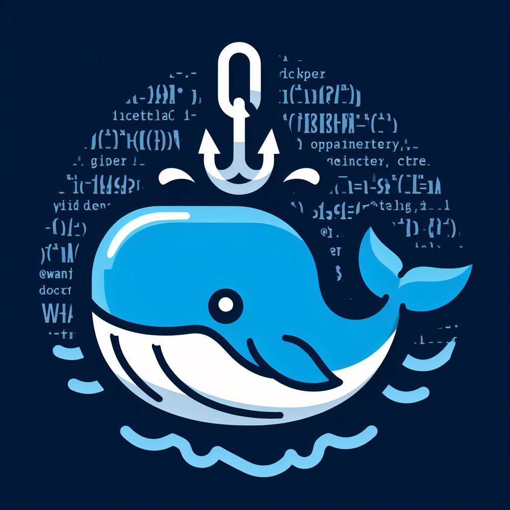

- [DockerHook](#dockerhook)
  - [Get started](#get-started)
  - [Environment Variables](#environment-variables)
    - [`CONFIG_PATH`](#config_path)
  - [WebHook](#webhook)
    - [Url](#url)
    - [Query Parameters](#query-parameters)
      - [`action`](#action)
      - [`token`](#token)
  - [Config Properties](#config-properties)
    - [`config`](#config)
      - [`labelBased`](#labelbased)
      - [`defaultAction`](#defaultaction)
      - [`removeOldImage`](#removeoldimage)
    - [`auth`](#auth)
      - [`enable`](#enable)
      - [`tokensFile`](#tokensfile)
      - [`tokens`](#tokens)
  - [Examples](#examples)

# DockerHook

<p align="center">
  
</p>

DockerHook is a way to manage your Docker processes using a Webhook!

## Get started

Getting started with DockerHook is very easy, you simply need a Docker container and no additional configuration is required to get started.

```yaml
services:
  dockerHook:
    image: waxer59/dockerhook
    container_name: dockerHook
    ports:
      - "<desired-port>:8080"
    restart: always
    volumes:
      -  /var/run/docker.sock:/var/run/docker.sock
```

## Environment Variables

DockerHook uses the environment variables to allow you to customize the parameters

### `CONFIG_PATH`

* **Type**: `string`
* **Default**: `/etc/dockerhook/dockerhook.yml`

Specify the path where your configuration file is located

## WebHook

A webhook is an HTTP-based callback function, DockerHook only accepts **GET** requests to perform all actions.

### Url

This is the shape that the URL must have.

`http://exampleurl.com/<docker-service-name>?<query-parameters>`

### Query Parameters

#### `action`

* **Type**: `'start' | 'stop' | 'restart' | 'pull'`
* **Default**: `'pull'`

Specify the action to be done in the service

#### `token`

* **Type**: `string`

Specify the access token to control Webhook execution.

Specifies the access token to control the execution of the Webhook if the [`enable`](#enable) property of [`auth`](#auth) is set to `true`.

## Config Properties

Configuration properties allow you to mold DockerHook to your needs!

The DockerHook configuration file must have the extension `.yml` and it looks like this:

```yaml
config:
  labelBased: true
  # ...

auth:
  tokens:
    - token1
    - token2
  # ...
```

### `config`

#### `labelBased`

* **Type**: `boolean`
* **Default**: `false`

By default, DockerHook will have access to all containers, you can prevent this behavior by setting this property to `true` and adding the `dockerhook.enable=true` tag in the containers where you want DockerHook to have access.

#### `defaultAction`

* **Type**: `'start' | 'stop' | 'restart' | 'pull'`
* **Default**: `'pull'`

Defines the default action to be performed when the Webhook is called without any [`action`](#action) in the query parameters

#### `removeOldImage`

* **Type**: `boolean`
* **Default**: `false`

By default, DockerHook will not delete any images after updating a container by doing a pull. Set this property to `true` if you want that after updating a container image the previous one will be removed.

### `auth`

#### `enable`

* **Type**: `boolean`
* **Default** `false`

By default, DockerHook allows access to all, set this option to `true` if you want to set up a token access system.

#### `tokensFile`

* **Type**: `string`

Specify the path to the file where you will store your access tokens, these must be separated by line breaks, see example below and the file must be a text file:

```txt
token1
token2
```

> [!NOTE]
> In case [`tokensFile`](#tokensfile) and [`tokens`](#tokens) are filled both tokens will be merged.

#### `tokens`

* **Type**: `[]string`

Specify your access tokens

> [!NOTE]
> In case [`tokensFile`](#tokensfile) and [`tokens`](#tokens) are filled both tokens will be merged.

## Examples

Check the following examples:

* [Example configuration](./docs/examples/exampleConfig.yml)
* [Example docker compose](./docs/examples/docker-compose.yml)
